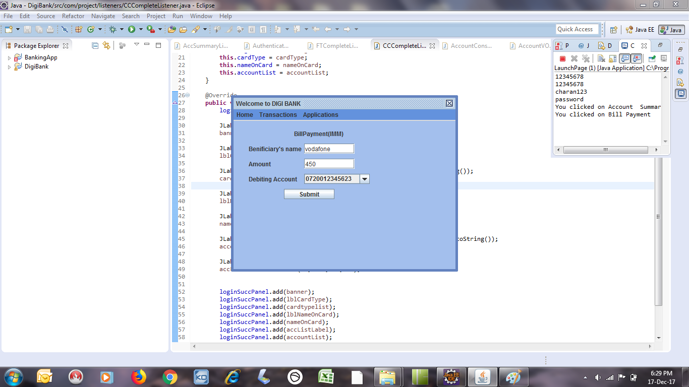

# Digital-Banking-Highschool

A digital banking application made in Java with a complete GUI built with Java AWT and Swing. 

## Images:

    

    

    

    

    

    

    

    

    

    

    

    

